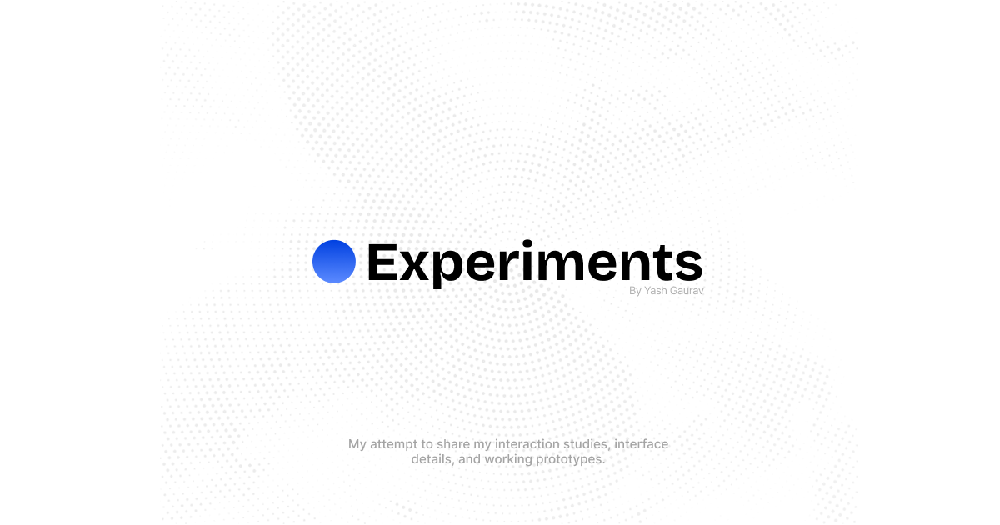

<p align="center">
  
</p>

# Experiments

A responsive gallery of interaction studies, interface details, and working prototypes.

## About this space

I made this project as a place to follow my curiosity about interfaces. It is where I can take a small interaction, an interesting transition, or a visual idea and spend enough time with it to understand why it feels good.

Some experiments begin with something I notice in a product. Others start as a rough thought, a reference shared by a friend, or a tiny detail that feels worth exploring. They do not need to become complete products. The point is to learn by making, keep the work visible, and let one idea lead naturally to the next.

This is a growing sketchbook rather than a finished catalogue. Things may be revised, simplified, or rebuilt as I learn more.

## Contributing

Contributions are welcome. You do not need to arrive with a finished implementation or a perfectly formed proposal.

You can contribute by:

- sharing an interaction or visual reference that would be interesting to study;
- suggesting a different direction for an existing idea;
- reporting a visual, responsive, or accessibility issue;
- improving the clarity or feel of an interaction;
- adding a focused experiment of your own;
- making the project easier for someone else to understand or explore.

Open an issue when you want to discuss an idea first. If you already know what you would like to change, feel free to open a pull request with a short note about the intention behind it. Thoughtful context is more valuable here than a long formal proposal.

Before submitting code, please check the experiment in the gallery and detail view, then run the production build.

## A note on inspiration

Interface work is shaped by the things we use, notice, and share with one another. References are treated as starting points for study rather than shortcuts to an identical result. When an experiment is closely inspired by someone else's work, the goal is to credit the source and be clear about what prompted the exploration.

## Development

```bash
npm install
npm run dev
```

Useful commands:

- `npm run build` — type-check and create a production build.
- `npm run lint` — run ESLint.
- `npm run format` — format TypeScript and TSX files.
- `npm run preview` — serve the production build locally.

## Architecture

- `src/experiments/` contains the individual experiments and the registry that powers gallery, detail, and mobile navigation.
- `src/components/gallery/` contains the desktop gallery shell and preview lifecycle.
- `src/components/backgrounds/` contains reusable visual surfaces used by experiments and `CardShell`.
- `src/pages/experiment-detail.tsx` renders an experiment alongside its exposed source files.
- `src/components/mobile-experiments.tsx` provides the compact mobile navigator.

Experiment components are lazy-loaded. Gallery previews mount only near the viewport, and the mobile and desktop application branches are split into separate chunks.

## Adding an experiment

1. Add the component under `src/experiments/` and keep experiment-specific CSS under `src/styles/`.
2. Register its id, title, description, lazy component, and source files in `src/experiments/index.ts`.
3. Include every shared component or stylesheet needed to understand the example in its `loadFiles` manifest.
4. Verify the experiment in the gallery, detail view, and mobile navigator.
5. Run `npm run build` before committing.

Registry ids and source filenames are validated for uniqueness. Source-file language is inferred from the filename extension.

## Deployment

The app uses `BrowserRouter`, so production hosting must route unknown paths back to `index.html`. Static assets are served from `public/`, while experiment modules and source files are bundled by Vite.

## Thanks for stopping by

If something here gives you an idea, makes you notice an interface differently, or encourages you to build a small experiment of your own, then this project is doing what I hoped it would.
