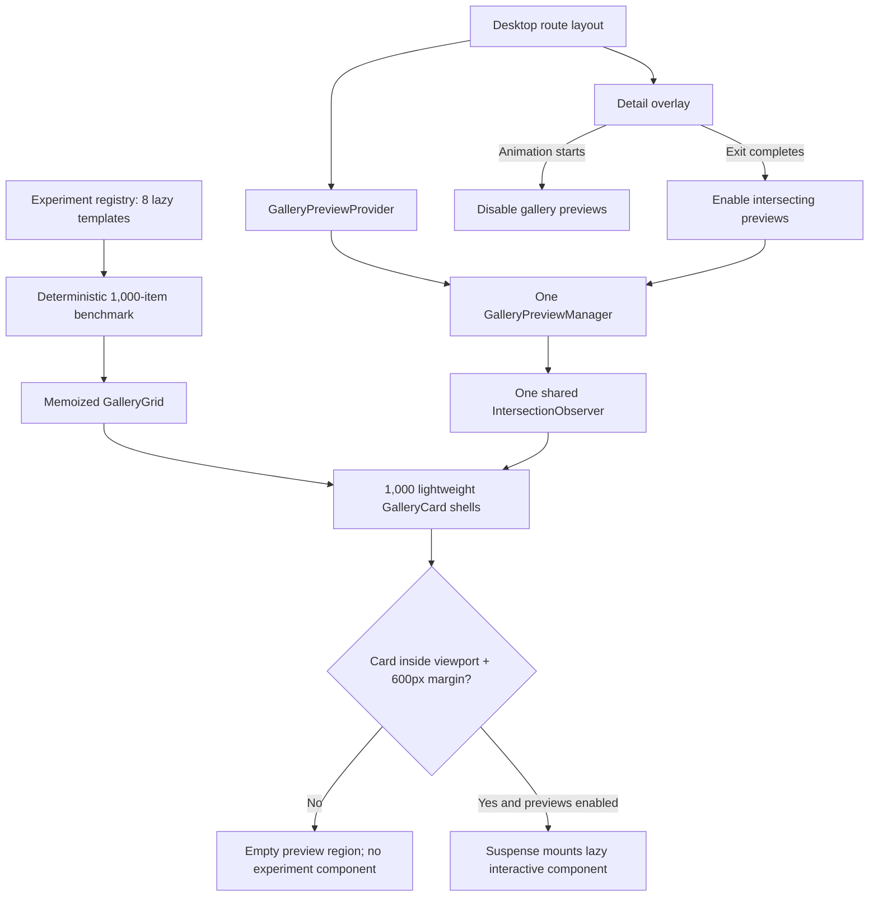

# Interactive Experiment Gallery Optimization Report

**Project:** React Experiments Gallery

**Report date:** July 18, 2026

**Branch:** `codex/viewport-lazy-experiments`

**Working-tree base commit:** `40e359b`

**Implementation status:** Active working-tree implementation; the optimization changes described here are not represented by the base commit alone.

**Primary objective:** Keep every gallery preview genuinely interactive while scaling the gallery without running every React/Framer Motion experiment at the same time.

## Contents

1. [Executive summary](#1-executive-summary)
2. [Current project metadata](#2-current-project-metadata)
3. [Experiment inventory and benchmark composition](#3-experiment-inventory-and-benchmark-composition)
4. [The original scaling problem](#4-the-original-scaling-problem)
5. [Architecture overview](#5-architecture-overview)
6. [Lazy experiment bundles](#6-optimization-layer-1-lazy-experiment-bundles)
7. [Independent source loading](#7-optimization-layer-2-source-files-load-independently)
8. [Lightweight card shells](#8-optimization-layer-3-lightweight-stable-card-shells)
9. [Gallery-scoped preview manager](#9-optimization-layer-4-gallery-scoped-preview-manager)
10. [Persistent gallery navigation](#10-optimization-layer-5-persistent-gallery-during-detail-navigation)
11. [Motion-coordinated preview lifecycle](#11-optimization-layer-6-motion-coordinated-preview-pause-and-resume)
12. [Accessibility](#12-accessibility-and-interaction-behavior)
13. [Development performance monitor](#13-development-performance-monitor)
14. [Desktop and mobile behavior](#14-desktop-and-mobile-are-optimized-differently)
15. [Runtime complexity](#15-runtime-complexity-model)
16. [Verification results](#16-verification-results)
17. [Architecture improvements](#17-why-this-model-is-cleaner-than-the-previous-implementation)
18. [Known limitations](#18-known-limitations-and-honest-tradeoffs)
19. [Recommended profiling protocol](#19-recommended-profiling-protocol)
20. [Adding an experiment safely](#20-adding-a-new-experiment-safely)
21. [File responsibility map](#21-file-responsibility-map)
22. [Maintenance invariants](#22-maintenance-invariants)
23. [Final assessment](#23-final-assessment)

---

## 1. Executive summary

The gallery uses a layered optimization model rather than one isolated technique:

1. Experiment JavaScript is split into lazy-loaded modules.
2. Source-code text is loaded separately and only when the detail view needs it.
3. All card shells remain available in the grid, but only cards near the viewport mount their interactive experiment component.
4. A gallery-scoped preview manager owns one shared `IntersectionObserver` and coordinates preview subscriptions.
5. When a detail overlay opens, every gallery preview is paused while the lightweight gallery shell remains mounted.
6. When the detail overlay closes, previews resume only after Framer Motion reports that its exit animation has completed.
7. The gallery tree and its scroll position are preserved during overlay navigation, avoiding the cost and stutter of rebuilding 1,000 cards on Back.
8. Card and grid components are memoized, and the development performance monitor subscribes independently so its counter does not rerender the whole grid.

The result is a gallery that still contains 1,000 navigable cards for stress testing, but ordinarily runs only approximately 6–10 interactive previews around the viewport. In the verified deep-scroll test, 10 of 1,000 previews were active, all previews dropped to 0 while the detail overlay was open, and the same 10 nearby previews resumed after returning. The scroll position remained exactly `6199px` throughout the transition.

This model deliberately does **not** preserve the internal React state of a preview after it leaves the activation range. These experiments are showcase previews, so discarding their state is an accepted tradeoff that substantially reduces background work.

---

## 2. Current project metadata

### 2.1 Application metadata

| Field                       | Current value                                           |
| --------------------------- | ------------------------------------------------------- |
| Package name                | `experiments`                                           |
| Package version             | `0.0.1`                                                 |
| Package type                | ESM (`"type": "module"`)                                |
| Desktop gallery route       | `/`                                                     |
| Experiment detail route     | `/experiments/:id`                                      |
| Real experiment templates   | 8                                                       |
| Stress-test gallery entries | 1,000 total                                             |
| Heavy entries               | 150, or 15%                                             |
| Standard entries            | 850, or 85%                                             |
| Preview activation margin   | `600px 0px` around the viewport                         |
| Preview-state preservation  | No; preview state is intentionally discarded on unmount |
| Current benchmark shuffle   | Deterministic seeded shuffle                            |
| Shuffle seed                | `0x5f3759df`                                            |
| Mobile presentation         | One active experiment at a time; no 1,000-card grid     |

### 2.2 Core technology stack

| Layer                 | Package / browser API     | Version or configuration                  | Role                                                                |
| --------------------- | ------------------------- | ----------------------------------------- | ------------------------------------------------------------------- |
| UI runtime            | React                     | `^19.2.6`                                 | Components, Suspense, context, hooks, external-store subscriptions  |
| DOM renderer          | React DOM                 | `^19.2.6`                                 | Browser rendering                                                   |
| Motion                | `motion`                  | `^12.42.2`                                | Framer Motion-compatible animation primitives and route transitions |
| Routing               | React Router DOM          | `^7.18.1`                                 | Gallery/detail routes and navigation state                          |
| Build tool            | Vite                      | `^8`                                      | Development server, production bundling, dynamic imports            |
| Language              | TypeScript                | `~6`                                      | Static typing and project build checks                              |
| Styling               | Tailwind CSS              | `^4`                                      | Layout, responsive styling, states, and utility classes             |
| Tailwind integration  | `@tailwindcss/vite`       | `^4`                                      | Vite/Tailwind integration                                           |
| React compilation     | `@vitejs/plugin-react`    | `^6`                                      | React transform and Fast Refresh                                    |
| Code highlighting     | Shiki                     | `^4.3.1`                                  | Detail-page source rendering                                        |
| UI primitives         | Base UI / shadcn packages | `@base-ui/react ^1.6.0`, `shadcn ^4.13.0` | Tabs and supporting UI primitives                                   |
| Icons                 | Lucide React              | `^1.24.0`                                 | Gallery and navigation icons                                        |
| Visibility scheduling | `IntersectionObserver`    | Browser API                               | Shared near-viewport activation signal                              |
| Store subscription    | `useSyncExternalStore`    | React API                                 | Isolated mounted-preview counter updates                            |

The project does not currently declare a Node.js version in `package.json`, so this report does not claim a pinned Node runtime.

### 2.3 Relevant commands

```json
{
  "dev": "vite",
  "build": "tsc -b && vite build",
  "lint": "eslint .",
  "format": "prettier --write \"**/*.{ts,tsx}\"",
  "typecheck": "tsc --noEmit",
  "preview": "vite preview"
}
```

---

## 3. Experiment inventory and benchmark composition

The registry has 8 real experiment templates. The 1,000-card benchmark is generated from these templates rather than maintaining 1,000 separate component modules.

| Template          | Base ID              | Category | Source files exposed | Total benchmark entries |
| ----------------- | -------------------- | -------- | -------------------: | ----------------------: |
| Rainbow Dot Field | `rainbow-dot-field`  | Standard |            TSX + CSS |                     142 |
| Metric Matrix     | `metric-matrix`      | Standard |            TSX + CSS |                     142 |
| Create Modal      | `create-modal`       | Standard |            TSX + CSS |                     142 |
| Icon Reveal       | `icon-reveal`        | Standard |            TSX + CSS |                     142 |
| Motion Button     | `motion-button-demo` | Standard |                  TSX |                     141 |
| iMessage Menu     | `imessage-menu`      | Standard |                  TSX |                     141 |
| Codex Phone       | `codex-phone`        | Heavy    |                  TSX |                      75 |
| Codex Atmosphere  | `codex-atmosphere`   | Heavy    |            TSX + CSS |                      75 |
| **Total**         |                      |          |                      |               **1,000** |

The heavy group contains the phone/atmosphere experiments because they include comparatively expensive visual work such as video, canvas, and cursor-reactive rendering. The generated distribution is exactly 150 heavy entries and 850 standard entries.

The generation model is:

```ts
const LOAD_TEST_EXPERIMENT_COUNT = 1_000
const LOAD_TEST_HEAVY_RATIO = 0.15
const LOAD_TEST_SHUFFLE_SEED = 0x5f3759df
const HEAVY_EXPERIMENT_IDS = new Set(["codex-phone", "codex-atmosphere"])
```

The registry retains the 8 originals, creates the required number of copies, and then applies a seeded Fisher–Yates shuffle. Copy IDs are stable and unique:

```ts
return {
  ...template,
  id: `${template.id}-load-test-${copyNumber}`,
  title: `${template.title} · Test ${copyNumber}`,
}
```

This is useful as a deterministic regression workload:

- The same experiments appear in the same order after every reload.
- Heavy experiments are distributed through the list instead of being grouped together.
- Performance comparisons are less likely to be distorted by a different random ordering on each run.
- Generated entries reuse the same lazy component type and source loader as their template; the benchmark does not create 1,000 different JavaScript chunks.

### Benchmark caveat

This benchmark is intentionally harsher than the normal product dataset, but it is not a perfect simulation of 1,000 unique experiments. Copies share component modules, assets, and source-loader closures. It accurately stresses card count, observer subscriptions, DOM layout, navigation, component mounting, animation cleanup, and the mixture of heavy/standard previews. It does not fully reproduce the network and parsing cost of 1,000 unique component bundles.

---

## 4. The original scaling problem

The unoptimized model mounted every experiment component in every card:

```tsx
{
  experiments.map(({ Component, id }) => (
    <article key={id}>
      <Component />
    </article>
  ))
}
```

That design scales poorly because each experiment may independently create some combination of:

- React state and effects;
- Framer Motion animation values and animation frames;
- pointer and keyboard listeners;
- `requestAnimationFrame` loops;
- canvas contexts and drawing work;
- video elements and decoding/compositing work;
- timers, observers, or resize handlers;
- large subtrees and style calculations.

Even experiments far outside the viewport can continue consuming CPU, GPU, memory, media, and React scheduling time. The resulting workload grows approximately with the number of mounted experiments rather than with the number that the user can see.

The central performance decision is therefore:

> Keep the card shell and navigation target available, but only mount the expensive interactive preview within a bounded range around the viewport.

This preserves interactivity where it matters without converting previews into screenshots.

---

## 5. Architecture overview



The optimization has four separate lifetimes:

1. **Registry lifetime:** metadata and lazy component references exist for the application session.
2. **Gallery shell lifetime:** cards remain mounted while navigating through an overlay detail view.
3. **Preview lifetime:** an experiment component exists only while its card is near the viewport and preview execution is enabled.
4. **Detail lifetime:** the selected experiment and its source viewer mount for the active detail route.

Separating these lifetimes is the key architectural improvement. A card does not need to destroy its identity merely because its expensive child preview is inactive, and the entire gallery does not need to rebuild merely because the user opened one detail page.

---

## 6. Optimization layer 1: lazy experiment bundles

Every real experiment component is registered with `React.lazy`:

```ts
const RainbowDotField = lazy(() => import("./rainbow-dot-field"))
const MetricMatrix = lazy(() => import("./metric-matrix"))
const CreateModal = lazy(() => import("./create-modal"))
const IconReveal = lazy(() => import("./icon-reveal"))
const MotionButtonDemo = lazy(() => import("./motion-button"))
const CodexPhone = lazy(() => import("./iphone"))
const CodexAtmosphere = lazy(() => import("./codex-atmosphere"))
const ImessageMenu = lazy(() => import("./imessage-menu"))
```

Vite turns these dynamic imports into separate chunks. Consequences:

- The initial application bundle does not eagerly execute every experiment module.
- A component chunk is requested when the first active preview or detail view needs it.
- All generated copies of a template share the same `LazyExoticComponent`, so a module is fetched and evaluated once rather than once per copy.
- `Suspense` provides a stable loading boundary for both gallery previews and detail views.

The card-level boundary is:

```tsx
{
  isNearViewport ? (
    <Suspense fallback={<ExperimentLoading />}>
      <Component />
    </Suspense>
  ) : null
}
```

`React.lazy` alone would not solve the frame-rate problem. Once a lazy module is loaded, rendering 1,000 instances would still create 1,000 active components. Lazy bundles reduce loading and initial execution; viewport activation controls runtime concurrency.

---

## 7. Optimization layer 2: source files load independently

The source viewer uses Vite raw imports, but the source text is not imported into the main registry chunk immediately:

```ts
load: () => import("./rainbow-dot-field.tsx?raw")
```

Each experiment exposes a `loadFiles()` function instead of a preloaded array. `loadSourceFiles()` memoizes the promise:

```ts
function loadSourceFiles(definitions: ExperimentSourceDefinition[]) {
  let filesPromise: Promise<ExperimentSourceFile[]> | undefined

  return () => {
    filesPromise ??= Promise.all(
      definitions.map(async ({ load, ...file }) => ({
        ...file,
        code: (await load()).default,
      }))
    )

    return filesPromise
  }
}
```

This produces several benefits:

- Gallery cards do not download or retain source strings they never display.
- Source is requested only when the detail view mounts `ExperimentSource`.
- Reopening the same template reuses the cached promise.
- Generated copies share their template's `loadFiles` closure, so opening different copies of the same experiment does not repeatedly import identical source text.
- The source UI has explicit loading and error states.

The detail page also separates experiment rendering from source rendering. The selected interactive component can appear through its own Suspense boundary while source text and syntax highlighting resolve independently.

---

## 8. Optimization layer 3: lightweight, stable card shells

The grid intentionally renders all 1,000 **shells**, not all 1,000 experiments:

```tsx
<section className="grid grid-cols-1 gap-4 xl:grid-cols-2 2xl:grid-cols-3">
  {items.map((item) => (
    <GalleryCard key={item.id} {...item} />
  ))}
</section>
```

Each shell contains:

- one `article` used as the observer target;
- title and description metadata;
- the route link;
- an empty preview region when inactive;
- the interactive component only while active.

The card shell uses a plain semantic `<article>` rather than wrapping all 1,000 cards in `motion.article`. This avoids creating a large number of motion objects and per-card animation subscriptions for route-level effects that are not necessary to the experience.

`GalleryCard` and `GalleryGrid` are exported through `memo()`:

```ts
export default memo(GalleryCard)
export default memo(GalleryGrid)
```

The registry array and item objects are stable at module scope, so memoization prevents unrelated parent updates—such as route animation state—from forcing every card to rerender.

### What still costs resources

The shells are not free. With 1,000 entries, the browser still has to manage:

- 1,000 article elements and their metadata subtrees;
- grid layout and document height;
- 1,000 observer registrations;
- link/accessibility nodes;
- style calculation for the shell UI.

This is an intentional middle ground. It preserves native document scrolling, direct links, browser find/accessibility structure, and stable scroll restoration. If the gallery grows far beyond this benchmark, card-shell virtualization or pagination may become the next optimization layer.

---

## 9. Optimization layer 4: gallery-scoped preview manager

### 9.1 Why a manager exists

A naive hook would create one `IntersectionObserver` per card. With 1,000 cards, that would mean 1,000 observer instances and 1,000 callbacks. The current model creates one manager per mounted gallery and one shared browser observer.

The ownership boundary is explicit:

```tsx
export function GalleryPreviewProvider({ children, enabled }) {
  const [manager] = useState(() => new GalleryPreviewManager(enabled))

  useLayoutEffect(() => {
    manager.setEnabled(enabled)
  }, [enabled, manager])

  useEffect(() => () => manager.destroy(), [manager])

  return (
    <GalleryPreviewContext.Provider value={manager}>
      {children}
    </GalleryPreviewContext.Provider>
  )
}
```

This replaces application-wide mutable state. The manager:

- is created once for a gallery provider instance;
- is accessed through React context;
- owns its observer, records, sets, and counter subscriptions;
- receives an explicit `enabled` input from the route layout;
- disconnects and clears itself when the gallery truly unmounts.

Because the context value is the stable manager object, changing `enabled` does not make all 1,000 context consumers rerender. The provider updates the manager in a layout effect, and the manager notifies only records whose active state actually changes.

### 9.2 Observer configuration

```ts
this.observer ??= new IntersectionObserver(callback, {
  root: null,
  rootMargin: "600px 0px",
  threshold: 0,
})
```

| Option       | Value       | Meaning                                                             |
| ------------ | ----------- | ------------------------------------------------------------------- |
| `root`       | `null`      | Observe relative to the browser viewport                            |
| `rootMargin` | `600px 0px` | Activate previews up to 600px before they enter from above or below |
| `threshold`  | `0`         | Any intersection with the expanded root is sufficient               |

The 600px vertical buffer is a prewarming window. It reduces the chance that a user sees an empty/loading preview during normal scrolling while still bounding the number of active experiments. On the tested desktop viewport, it resulted in approximately 6–10 mounted previews rather than 1,000.

### 9.3 Per-card record model

Each observed card has a record:

```ts
type PreviewRecord = {
  element: Element
  isActive: boolean
  isIntersecting: boolean
  subscriber: (isNearViewport: boolean) => void
}
```

The manager maintains:

- `records`: lookup from DOM element to its record;
- `intersectingRecords`: only the records inside the expanded viewport;
- `activeCount`: the number of mounted gallery previews;
- `countSubscribers`: listeners for the development monitor;
- `enabled`: the route-level execution gate;
- `observer`: the single shared `IntersectionObserver`.

The distinction between **intersecting** and **active** is important:

```text
active = manager enabled AND card intersects expanded viewport
```

A card can remain near the viewport while inactive because the detail overlay has globally paused gallery previews.

### 9.4 Targeted updates

Observer entries update only the cards whose intersection status changed:

```ts
activeCountChanged =
  this.setRecordActive(record, this.enabled && entry.isIntersecting) ||
  activeCountChanged
```

Changing the route-level gate iterates only `intersectingRecords`, not every registered card:

```ts
setEnabled(enabled: boolean) {
  if (enabled === this.enabled) return

  this.enabled = enabled
  let activeCountChanged = false

  this.intersectingRecords.forEach((record) => {
    activeCountChanged =
      this.setRecordActive(record, enabled) || activeCountChanged
  })

  if (activeCountChanged) this.emitActiveCount()
}
```

This means opening the detail view normally unmounts roughly 6–10 active previews rather than scanning and updating 1,000 React card states.

Count notifications are batched once per observer callback or enable/disable operation. Without that batching, changing 10 records could notify the performance monitor 10 times.

### 9.5 Hook contract

Cards use a small hook API:

```ts
export function useNearViewport<T extends Element>() {
  const manager = useGalleryPreviewManager()
  const viewportRef = useRef<T>(null)
  const [isNearViewport, setIsNearViewport] = useState(false)

  useEffect(() => {
    const element = viewportRef.current
    if (!element) return

    return manager.observe(element, setIsNearViewport)
  }, [manager])

  return { isNearViewport, viewportRef }
}
```

The ref is a stable `useRef`, not React state. Assigning the DOM element therefore does not cause a second render for every card. The hook subscribes after mount and unregisters during cleanup.

If `IntersectionObserver` is unavailable, the manager intentionally falls back to treating the card as intersecting. This preserves functionality in unsupported environments, although it loses the performance benefit there.

---

## 10. Optimization layer 5: persistent gallery during detail navigation

### 10.1 Why preserving the gallery matters

Unmounting the gallery when a detail page opens appears memory-efficient, but returning requires React and the browser to rebuild:

- all 1,000 card elements;
- all hook instances and observer registrations;
- the grid layout and document height;
- intersection state for the restored scroll location;
- preview components around that location.

That work previously coincided with the detail exit animation and scroll restoration, producing a visible frame drop or stutter.

The route layout now preserves the gallery when a detail route was opened from it:

```tsx
{
  isGalleryRoute || isOverlayTransition ? (
    <ExperimentsGallery
      isDetailOpen={isOverlayTransition}
      previewsEnabled={galleryPreviewsEnabled && !isDetailRoute}
    />
  ) : null
}
```

The detail route is rendered as a fixed overlay sibling. The gallery remains underneath with its DOM tree and native scroll position intact.

Directly loading an experiment URL is handled differently. Without `transitionFromGallery` navigation state, the detail view renders as a direct route and does not manufacture a hidden background gallery. This avoids paying for 1,000 shells when a visitor lands directly on one experiment.

### 10.2 Overlay identification

Gallery cards provide route state:

```tsx
<Link
  to={`/experiments/${id}`}
  state={{ transitionFromGallery: true }}
  aria-label={`View ${title}`}
>
```

The desktop router detects that state:

```ts
const isOverlayTransition = Boolean(
  isDetailRoute && transitionState?.transitionFromGallery
)
```

This state is also retained while using previous/next controls in the detail view, so navigating between experiments stays within the overlay presentation.

### 10.3 Scroll preservation

No manual `scrollTo`, saved scroll-state variable, timer, or animation-frame restoration is needed. The same gallery DOM remains mounted and `document.body` remains at the same scroll offset. While the overlay is open, body scrolling is locked:

```ts
const previousOverflow = document.body.style.overflow
document.body.style.overflow = "hidden"

return () => {
  document.body.style.overflow = previousOverflow
}
```

Because the original overflow value is restored during cleanup, the route does not permanently alter a host page's scroll styling.

---

## 11. Optimization layer 6: motion-coordinated preview pause and resume

Preview execution is coordinated with the actual animation lifecycle instead of a hardcoded timeout.

### Opening detail

The route itself immediately prevents preview activation through `!isDetailRoute`. The detail overlay's animation start also latches the preview state as paused:

```tsx
<motion.div
  key="detail"
  onAnimationStart={pauseGalleryPreviews}
  // ...
>
```

```ts
const pauseGalleryPreviews = useCallback(() => {
  setGalleryPreviewsEnabled(false)
}, [])
```

The manager then notifies the currently intersecting cards, causing their experiment components to unmount. Canvas/video/animation work in the hidden gallery therefore does not continue behind the detail page.

### Returning to the gallery

When navigation changes back to `/`, the gallery becomes visible underneath the exiting overlay, but the latch remains false. Preview components do not compete with the exit transition. `AnimatePresence` enables them only after all exiting motion has completed:

```tsx
<AnimatePresence
  initial={false}
  mode="sync"
  onExitComplete={handleExitComplete}
>
```

```ts
const handleExitComplete = useCallback(() => {
  if (isGalleryRoute) {
    setGalleryPreviewsEnabled(true)
  }
}, [isGalleryRoute])
```

This is more robust than a `setTimeout(360)` implementation. If animation duration or reduced-motion behavior changes, preview resumption remains attached to actual completion rather than an independently maintained number.

### Route/preview state matrix

| Phase             | Gallery shell | Gallery accessibility        | Preview manager |    Active previews | Detail           |
| ----------------- | ------------- | ---------------------------- | --------------- | -----------------: | ---------------- |
| Initial gallery   | Mounted       | Interactive                  | Enabled         | Near-viewport only | Unmounted        |
| Detail entering   | Preserved     | Inert/hidden                 | Disabled        |                  0 | Entering         |
| Detail open       | Preserved     | Inert/hidden                 | Disabled        |                  0 | Mounted          |
| Back initiated    | Preserved     | Interactive as route returns | Still disabled  |                  0 | Exiting          |
| Exit completed    | Preserved     | Interactive                  | Enabled         | Near-viewport only | Unmounted        |
| Direct detail URL | Not mounted   | N/A                          | N/A             |                  0 | Mounted directly |

---

## 12. Accessibility and interaction behavior

Keeping the gallery in the DOM under an overlay requires more than disabling pointer events. Otherwise keyboard focus and assistive technology could still reach hidden gallery controls.

The gallery root applies:

```tsx
<main
  inert={isDetailOpen}
  aria-hidden={isDetailOpen ? "true" : undefined}
  className={isDetailOpen ? "pointer-events-none" : ""}
>
```

This combination provides three protections:

- `inert` prevents focus and user interaction within the covered subtree;
- `aria-hidden` removes the covered gallery from the accessibility tree;
- `pointer-events-none` prevents pointer interaction during the visual transition.

The overlay is exposed as a modal dialog only when it was opened from the gallery:

```tsx
role={isOverlayTransition ? "dialog" : undefined}
aria-modal={isOverlayTransition ? "true" : undefined}
aria-label={isOverlayTransition ? "Experiment details" : undefined}
```

Overlay details can be closed with the visible Back control or the Escape key. Gallery links and previous/next controls have descriptive accessible names.

One possible future enhancement is explicit focus capture/restoration: move focus into the dialog on entry and return it to the originating card link after exit. The current implementation handles inertness and keyboard closing but does not retain a reference to the exact originating link.

---

## 13. Development performance monitor

Development builds render a fixed counter:

```tsx
function GalleryPerformanceMonitor({ totalCount }: { totalCount: number }) {
  const mountedPreviewCount = useNearViewportCount()

  if (!import.meta.env.DEV) return null

  return (
    <div data-testid="gallery-performance-monitor">
      {mountedPreviewCount} / {totalCount} previews mounted
    </div>
  )
}
```

`useNearViewportCount()` uses `useSyncExternalStore`, so the counter subscribes directly to the manager:

```ts
return useSyncExternalStore(
  manager.subscribeToCount,
  manager.getActiveCount,
  () => 0
)
```

This separation matters. If the count lived in `GalleryGrid` state, every intersection change could rerender the grid component and recreate 1,000 card elements at the React reconciliation level. The isolated subscriber updates only the monitor.

The monitor is excluded from production rendering through `import.meta.env.DEV`, while its source remains useful for automated local verification through `data-testid="gallery-performance-monitor"`.

---

## 14. Desktop and mobile are optimized differently

The desktop experience is a large browseable grid, so it needs viewport scheduling and persistent overlay navigation.

The mobile experience intentionally renders only one experiment at a time:

```tsx
<Suspense fallback={<ExperimentLoading />}>
  <Component />
</Suspense>
```

Previous/next buttons replace the active detail route and `AnimatePresence` transitions between one experiment and the next. Since mobile never mounts the 1,000-card gallery, it does not use the gallery preview provider or shared observer.

This avoids applying desktop complexity to a surface that already has a naturally bounded active component count of one.

---

## 15. Runtime complexity model

Let:

- `N` be the number of gallery cards, currently 1,000;
- `K` be the number of cards intersecting the viewport plus 600px margin, typically about 6–10 in the verified desktop viewport;
- `H` be the number of active heavy previews within `K`.

### Initial gallery construction

- React card-shell creation: `O(N)`
- DOM shell count: `O(N)`
- observer registrations: `O(N)`
- loaded interactive preview instances: `O(K)`
- active experiment animation/media work: approximately `O(K)`, with actual cost affected by `H`

### Scrolling

- browser observer work: delivered in batched intersection entries;
- React updates: only cards crossing the expanded viewport boundary;
- mounted interactive previews: bounded around `K`, not `N`.

### Opening detail

- shell rebuild: none;
- preview deactivation: `O(K)` via `intersectingRecords`;
- detail mount: one experiment plus its source viewer.

### Returning from detail

- shell rebuild: none;
- scroll restoration: none; native position was preserved;
- preview reactivation after exit: `O(K)`;
- observer re-registration: none.

### Memory tradeoff

The architecture exchanges card-shell memory for transition smoothness. It retains `O(N)` lightweight DOM nodes while eliminating `O(N)` active React experiment subtrees. This is the correct tradeoff for the current showcase and 1,000-card test, but it is not infinite-list virtualization.

---

## 16. Verification results

### 16.1 Automated/static checks

The current implementation passed:

- targeted Prettier formatting;
- targeted ESLint checks for all refactored gallery files;
- `npm run typecheck` (`tsc --noEmit`);
- `npm run build` (`tsc -b && vite build`);
- `git diff --check`.

### 16.2 Production build snapshot

Latest verified Vite production output:

| Asset                       |  Raw size | Gzip size |
| --------------------------- | --------: | --------: |
| Main application JavaScript | 474.86 kB | 150.70 kB |
| Main stylesheet             | 209.38 kB |  31.81 kB |
| Shiki/highlight chunk       | 397.29 kB |  83.96 kB |

Experiment modules and styles are emitted as separate smaller chunks. Build hashes are content-dependent and will change after source edits.

The sizable Shiki chunk is acceptable under the current model because source presentation is detail-oriented, but it remains a candidate for further route-level loading analysis if initial-network performance becomes a concern.

### 16.3 Browser navigation verification

The final deep-scroll navigation test produced:

| Phase                 | Route                                         | Scroll position | Card shells | Mounted gallery previews |
| --------------------- | --------------------------------------------- | --------------: | ----------: | -----------------------: |
| Before opening detail | `/`                                           |          6199px |       1,000 |                       10 |
| Detail overlay open   | `/experiments/codex-atmosphere-load-test-128` |          6199px |       1,000 |                        0 |
| After returning       | `/`                                           |          6199px |       1,000 |                       10 |

This validates the important invariants:

- the gallery tree remains mounted;
- hidden previews stop executing;
- route navigation does not move the document;
- previews resume around the restored viewport;
- the system does not remount all 1,000 experiment components.

These measurements validate mount behavior and lifecycle coordination. They are not a substitute for a formal FPS trace. For frame-rate regression testing, use Chrome Performance or React Profiler with a fixed scroll/navigation script and compare long tasks, main-thread time, dropped frames, and active media/canvas work across builds.

---

## 17. Why this model is cleaner than the previous implementation

The earlier working approach had two coordination weaknesses:

1. Preview records and the enabled flag lived in module-level mutable collections.
2. Preview resumption used a fixed timeout intended to match the exit animation duration.

The current model improves those boundaries:

| Concern             | Earlier approach                    | Current approach                                        |
| ------------------- | ----------------------------------- | ------------------------------------------------------- |
| Manager ownership   | Module singleton                    | One instance owned by `GalleryPreviewProvider`          |
| Enabled input       | Global setter                       | Explicit provider prop                                  |
| Multiple galleries  | Shared implicit state               | Separate manager per provider instance                  |
| Cleanup             | Depended on global subscriber count | Provider destroys its manager                           |
| Resume timing       | Hardcoded milliseconds              | `AnimatePresence.onExitComplete`                        |
| Context updates     | N/A                                 | Stable manager value; no 1,000-consumer rerender        |
| Count notifications | Potentially one per record          | Batched per operation                                   |
| Testability         | Hidden module lifecycle             | Manager can be instantiated and exercised independently |

The provider/manager design is still intentionally small. It does not introduce Redux, a general event bus, or a virtualization framework for one gallery-specific responsibility.

---

## 18. Known limitations and honest tradeoffs

### 18.1 The benchmark currently replaces the normal registry

`experiments` is currently exported as the 1,000-item generated workload:

```ts
export const experiments = createLoadTestExperiments()
```

That is appropriate while testing but should probably become a development flag, query parameter, or dedicated benchmark route before production. Otherwise production users receive 1,000 metadata entries and routes even when only the 8 real experiments are intended.

A production-oriented pattern could be:

```ts
export const experiments = import.meta.env.DEV
  ? createLoadTestExperiments()
  : experimentTemplates
```

Alternatively, keep `/` as the real gallery and expose `/benchmarks/gallery?count=1000&heavy=0.15` for repeatable profiling.

### 18.2 Card shells are not virtualized

Interactive preview work is bounded, but 1,000 card shells remain in the DOM. If shell layout becomes the next bottleneck, evaluate:

- CSS `content-visibility: auto` with a correct intrinsic size;
- row/window virtualization that preserves predictable geometry;
- pagination or incremental loading;
- a separate benchmark mode that can trade accessibility/findability for scale.

Virtualization should not be added casually. Variable responsive grid sizes, native scroll restoration, focus targets, accessibility order, and detail-return behavior all need explicit handling.

### 18.3 Component cleanup remains an experiment responsibility

Viewport unmounting saves resources only if each experiment cleans up correctly. Every experiment that creates timers, animation frames, media playback, observers, or global listeners must release them in its effect cleanup.

Recommended pattern:

```ts
useEffect(() => {
  let frame = requestAnimationFrame(render)

  return () => {
    cancelAnimationFrame(frame)
  }
}, [])
```

An experiment with leaked global work could continue consuming resources even after React removes its preview DOM.

### 18.4 The 600px margin is a policy, not a universal constant

`600px` performed well for the current card dimensions and desktop viewport. Smaller values reduce concurrency but may reveal loading. Larger values prewarm more smoothly but activate more experiments. It should be tuned with controlled traces on representative devices.

### 18.5 No preview-state preservation

Leaving the activation window unmounts the experiment. Inputs, toggles, and animation progress reset when it returns. This is accepted for the showcase. If a future experiment requires state preservation, state should be lifted selectively for that experiment rather than retaining every inactive component.

### 18.6 Focus restoration can be improved

The hidden gallery is inert and the overlay supports Escape, but focus is not explicitly returned to the exact card link that opened the detail. This is an accessibility improvement opportunity independent of the performance architecture.

---

## 19. Recommended profiling protocol

To measure frame-rate changes reliably, avoid judging only by manually scrolling a different random list on each build. Use the deterministic seed and repeat the same scenario.

### Test environment

Record:

- browser and version;
- operating system;
- device hardware;
- viewport size and device-pixel ratio;
- production or development build;
- CPU throttling level;
- whether React DevTools/React Scan are enabled;
- whether media assets were warm in cache.

Prefer a production build for absolute performance measurements. Development mode adds diagnostics and the preview counter, and React tooling can materially affect results.

### Suggested scenarios

1. Cold-load `/` and wait for above-the-fold previews.
2. Scroll from the top to a fixed offset such as 6,200px at a repeatable speed.
3. Open the same heavy experiment ID.
4. Wait for detail entry to complete.
5. Navigate Back.
6. Continue scrolling after preview resumption.
7. Repeat at least 5 times and compare medians rather than one run.

### Metrics to inspect

- dropped frames and frame-duration spikes;
- long tasks over 50ms;
- scripting, rendering, and painting time;
- React commit durations and number of updated components;
- number of active canvases/videos;
- mounted preview count;
- memory growth over repeated navigation;
- network chunk requests on cold load;
- scroll-position accuracy after Back.

### Expected invariants

- mounted preview count remains a small fraction of total cards;
- detail overlay drives gallery preview count to 0;
- card shell count remains stable during overlay navigation;
- scroll offset is unchanged;
- preview count returns only after the exit completes;
- repeated navigation does not steadily increase listeners, animation frames, canvas elements, or memory.

---

## 20. Adding a new experiment safely

When registering a new experiment:

1. Export the component as a lazy import.
2. Add stable metadata: `id`, `title`, `description`, `year`, and `tags`.
3. Add lazy raw imports for every source file shown in the detail view.
4. Ensure the component sizes itself to its container, not the global viewport.
5. Verify all effects clean up on unmount.
6. Test the component repeatedly entering and leaving the 600px activation window.
7. Decide whether it belongs in `HEAVY_EXPERIMENT_IDS` for benchmark distribution.
8. Verify gallery and detail Suspense fallbacks.
9. Exercise keyboard/touch interaction and reduced-motion behavior.
10. Profile at least one list containing multiple copies of the experiment.

Example registry entry:

```ts
const NewExperiment = lazy(() => import("./new-experiment"))

{
  id: "new-experiment",
  title: "New Experiment",
  description: "A concise description of the interaction.",
  year: "2026",
  tags: ["Motion", "Interaction"],
  loadFiles: loadSourceFiles([
    {
      filename: "new-experiment.tsx",
      language: "tsx",
      load: () => import("./new-experiment.tsx?raw"),
    },
  ]),
  Component: NewExperiment,
}
```

---

## 21. File responsibility map

| File                                                  | Responsibility                                                                                                      |
| ----------------------------------------------------- | ------------------------------------------------------------------------------------------------------------------- |
| `src/experiments/index.ts`                            | Experiment metadata, lazy component imports, lazy source loaders, benchmark generation, heavy ratio, seeded shuffle |
| `src/App.tsx`                                         | Desktop/mobile route split, persistent gallery/detail layout, body scroll lock, preview pause/resume lifecycle      |
| `src/pages/experiments-gallery.tsx`                   | Gallery composition, preview provider boundary, inert/hidden behavior during overlay                                |
| `src/components/gallery/gallery-preview-provider.tsx` | Owns one preview manager instance and synchronizes explicit `enabled` state                                         |
| `src/hooks/use-gallery-preview.ts`                    | Shared observer manager, element records, active-count store, card hooks                                            |
| `src/components/gallery/galley-grid.tsx`              | Memoized card mapping and isolated development monitor                                                              |
| `src/components/gallery/gallery-card.tsx`             | Lightweight card shell, viewport subscription, Suspense-gated interactive preview, detail link                      |
| `src/components/experiment-loading.tsx`               | Shared fallback displayed while a lazy experiment chunk resolves                                                    |
| `src/pages/experiment-detail.tsx`                     | One active detail experiment, overlay animation, previous/next navigation, source panel                             |
| `src/components/code/experiment-source.tsx`           | On-demand source loading, cancellation guard, loading/error states, tabs                                            |
| `src/components/mobile-experiments.tsx`               | Mobile-only single-experiment carousel model                                                                        |

---

## 22. Maintenance invariants

Future refactors should preserve these rules unless the architecture is deliberately replaced:

1. Do not eagerly mount every experiment in the gallery.
2. Do not create one observer per card.
3. Do not store the observer manager as application-wide mutable module state.
4. Keep the context value stable so enable/disable does not rerender all cards.
5. Keep source strings out of the initial gallery path.
6. Do not resume previews on Back until the detail exit is complete.
7. Do not manually restore scroll while the gallery can remain mounted.
8. Keep the covered gallery inert and hidden from assistive technology.
9. Keep the performance counter isolated from the grid render path.
10. Require experiment effects to clean up when their preview unmounts.
11. Treat benchmark configuration separately from the real production catalog when testing is complete.

---

## 23. Final assessment

The current optimization model targets the correct bottleneck: the number of simultaneously active interactive experiments, not merely the number of JavaScript files or card images.

Its primary strength is that it bounds expensive runtime work to the viewport while retaining the gallery's real interactive nature. Lazy modules reduce startup cost, the shared observer limits mounted previews, the provider gives that scheduler a clear lifetime, and persistent overlay navigation avoids rebuilding the list during the most animation-sensitive transition.

For the current 1,000-card workload, the architecture is production-quality as a preview scheduler and route-transition model. Its main remaining scalability boundary is the deliberate retention of 1,000 lightweight card shells. That boundary should be addressed only if profiling shows DOM layout/style work becoming material after interactive component work has already been controlled.

The most important measured outcome is straightforward: in the verified workload, the application kept 1,000 navigable cards while running only 10 nearby previews, ran 0 hidden gallery previews during detail navigation, and returned to the exact same deep scroll position without rebuilding the gallery.
